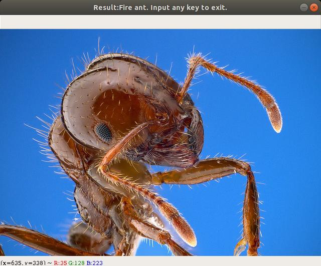

# Fire Ant Recognition By AutoML: For A real web services using AutoML
You can create a image classification model easily by the repository.
For example, I created the fire ant classification model by the repository.

## AutoKeras
AutoKeras is one of AutoML libraries made by H. Jin et al..

### Installation
Firstly, I will explain how to train the model by AutoKeras.

### Recommended environment
- For training
    - OS: Ubuntu 18.04 LTS
    - CPU: Core i7-6700K or later
    - GPU: GeForce GTX 1080 or later
    - Memory: 32GB+
- For inference
    - CPU: Core i7-6700K or later

### Installation
- (Option) I recommend to create a virtual environment for AutoKeras by venv.

- Install CUDA 10.0 and CuDNN 7:
```buildoutcfg
# Add NVIDIA package repositories
wget https://developer.download.nvidia.com/compute/cuda/repos/ubuntu1804/x86_64/cuda-repo-ubuntu1804_10.0.130-1_amd64.deb
sudo dpkg -i cuda-repo-ubuntu1804_10.0.130-1_amd64.deb
sudo apt-key adv --fetch-keys https://developer.download.nvidia.com/compute/cuda/repos/ubuntu1804/x86_64/7fa2af80.pub
sudo apt-get update
wget http://developer.download.nvidia.com/compute/machine-learning/repos/ubuntu1804/x86_64/nvidia-machine-learning-repo-ubuntu1804_1.0.0-1_amd64.deb
sudo apt install ./nvidia-machine-learning-repo-ubuntu1804_1.0.0-1_amd64.deb
sudo apt-get update

# Install NVIDIA driver
sudo apt-get install --no-install-recommends nvidia-driver-440
# Reboot. Check that GPUs are visible using the command: nvidia-smi

# Install development and runtime libraries.
# Plese be carefull whether the version of libcudnn7 exists.
sudo apt-get install --no-install-recommends \
    cuda-10-0 \
    libcudnn7=7.6.3.30-1+cuda10.0  \
    libcudnn7-dev=7.6.3.30-1+cuda10.0
```

- (Option) If you want to accelerate learning, install [TensorRT 6](https://docs.nvidia.com/deeplearning/sdk/tensorrt-archived/tensorrt-601/tensorrt-install-guide/index.html) instead of TensorRT 5 after you download TensorRT 6 repo.
```buildoutcfg
$ sudo dpkg -i nv-tensorrt-repo-ubuntu1x04-cuda10.0-trt6.x.x.x-ga-yyyymmdd_1-1_amd64.deb
$ sudo apt-key add /var/nv-tensorrt-repo-cudax10.0-trt6.x.x.x-ga-yyyymmdd/7fa2af80.pub

$ sudo apt-get update
$ sudo apt-get install tensorrt
$ sudo apt-get install python3-libnvinfer-dev
$ sudo apt-get install uff-converter-tf
```

- Install TensorFlow GPU 1.13.1:
```buildoutcfg
$ pip install tensorflow-gpu==1.13.1
```
 
- Install AutoKeras 0.4.0:
```buildoutcfg
$ pip install autokeras==0.4.0
```

- (Option) If you want to accelerate learning, install [apex](https://github.com/NVIDIA/apex) for PyTorch.
```buildoutcfg
$ git clone https://github.com/NVIDIA/apex
$ cd apex
$ pip install -v --no-cache-dir --global-option="--cpp_ext" --global-option="--cuda_ext" ./
```
- Download this repository:
```buildoutcfg 
$ git clone https://github.com/alfredplpl/FireAntRecognitionByAutoML.git
$ cd FireAntRecognitionByAutoML
```

### Train
TBD

### Predict
To predict a sample image, input the following command:
```buildoutcfg
python3 predictByAutoKeras.py
```
You will see the following window:



Then input any key to exit the program.

### Deploy on Cloud
You can deploy the model on cloud services.
Please see also: [FireAntRecognitionGCP (Github) ](https://github.com/alfredplpl/FireAntRecognitionGCP)

# Reference

```
@online{alfred2019,
  author    = {Afred Increment},
  title     = {Fire Ant Recognition By AutoML},
  year      = {2019},
}
@incollection{mendoza-automlbook18a,
  author    = {Hector Mendoza and Aaron Klein and Matthias Feurer and Jost Tobias Springenberg and Matthias Urban and Michael Burkart and Max Dippel and Marius Lindauer and Frank Hutter},
  title     = {Towards Automatically-Tuned Deep Neural Networks},
  year      = {2018},
  month     = dec,
  editor    = {Hutter, Frank and Kotthoff, Lars and Vanschoren, Joaquin},
  booktitle = {AutoML: Methods, Sytems, Challenges},
  publisher = {Springer},
  chapter   = {7},
  pages     = {141--156},
  note      = {To appear.},
}~~~~
@inproceedings{jin2019auto,
  title={Auto-Keras: An Efficient Neural Architecture Search System},
  author={Jin, Haifeng and Song, Qingquan and Hu, Xia},
  booktitle={Proceedings of the 25th ACM SIGKDD International Conference on Knowledge Discovery \& Data Mining},
  pages={1946--1956},
  year={2019},
  organization={ACM}
}
@online{jin2018efficient,
  author       = {Haifeng Jin and Qingquan Song and Xia Hu},
  title        = {Auto-Keras: An Efficient Neural Architecture Search System},
  date         = {2018-06-27},
  year         = {2018},
  eprintclass  = {cs.LG},
  eprinttype   = {arXiv},
  eprint       = {cs.LG/1806.10282},
}
```

Copyright (C) 2019  [Alfred Increment](https://alfredplpl.github.io/en/)